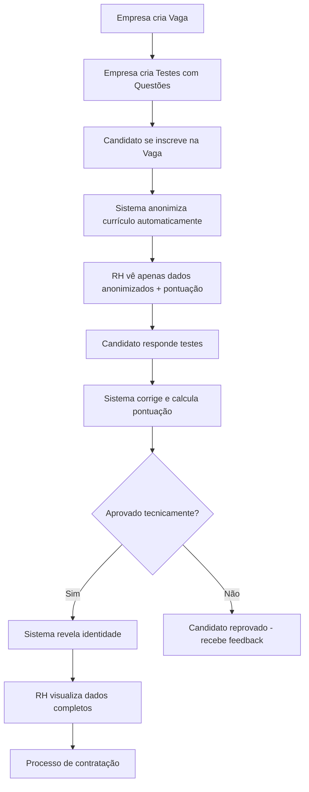

<div align="center"> 

  # 🤖 Plataforma de Recrutamento Justo com IA
  
</div>

## 👥 Integrantes do grupo:

- **[Guilherme Doretto Sobreiro]** - **[RM: 99674]**
- **[Guilherme Fazito Ziolli Sordili]** - **[RM: 550539]**
- **[Raí Gumieri dos Santos]** - **[RM: 98287]**

<div align="center"> 

  ## 📋 Sobre o Projeto

</div>

<div align="justify"> 
  
Plataforma digital que utiliza **Inteligência Artificial** para tornar o processo de recrutamento mais **justo, inclusivo e eficiente**. O sistema realiza a **anonimização automática de currículos**, removendo informações sensíveis como nome, idade, gênero, endereço e foto, permitindo que empresas avaliem candidatos com base **somente em habilidades, experiências e competências reais**.
  
</div>

### 🎯 Objetivos

- ✅ Eliminar vieses inconscientes no processo seletivo
- ✅ Promover diversidade e inclusão no mercado de trabalho
- ✅ Avaliar candidatos com base no **mérito técnico**
- ✅ Automatizar correção de testes e cálculo de pontuação
- ✅ Revelar identidade apenas após aprovação técnica

---

<div align="center"> 

  ## 🏗️ Arquitetura do Projeto

</div>

### Tecnologias Utilizadas

- **.NET 8.0** - Framework principal
- **ASP.NET Core Web API** - Criação de APIs RESTful
- **Entity Framework Core 8.0** - ORM para acesso ao banco de dados
- **SQL Server** - Banco de dados relacional
- **Swagger/OpenAPI** - Documentação interativa da API
- **API Versioning** - Controle de versões da API

### Estrutura de Pastas
```
RecrutamentoJusto.API/
├── Controllers/          # Endpoints da API (8 controllers)
├── Models/              # Entidades do banco de dados
├── DTOs/                # Objetos de transferência de dados
│   ├── Empresa/
│   ├── Usuario/
│   ├── Vaga/
│   ├── Candidato/
│   ├── Inscricao/
│   ├── Teste/
│   ├── Questao/
│   └── RespostaTeste/
├── Data/                # DbContext do Entity Framework
└── Migrations/          # Migrações do banco de dados
```

---
<div align="center">
  
  ## 🗄️ Modelo de Dados

</div>

O sistema possui **8 entidades principais**:

1. **Empresa** - Empresas cadastradas na plataforma
2. **Usuario** - Usuários do sistema (RH, Gestores, Admins)
3. **Vaga** - Vagas de emprego publicadas
4. **Candidato** - Candidatos cadastrados (com dados completos)
5. **Inscricao** - Inscrições em vagas (com currículo anonimizado) ⭐
6. **Teste** - Avaliações técnicas das vagas
7. **Questao** - Questões de múltipla escolha dos testes
8. **RespostaTeste** - Respostas dos candidatos (com correção automática)

### Relacionamentos Principais

- Uma **Empresa** possui várias **Vagas** e **Usuários**
- Uma **Vaga** possui vários **Testes** e **Inscrições**
- Um **Candidato** realiza várias **Inscrições**
- Uma **Inscrição** possui várias **RespostasTeste**
- Um **Teste** possui várias **Questões**

---
<div align="center"> 
  
  ## 🔧 Como Executar o Projeto

</div>

### Pré-requisitos

- [.NET 8.0 SDK](https://dotnet.microsoft.com/download/dotnet/8.0)
- [SQL Server](https://www.microsoft.com/sql-server) ou SQL Server LocalDB
- [Visual Studio 2022](https://visualstudio.microsoft.com/) ou [VS Code](https://code.visualstudio.com/)

### Passo a Passo

1. **Clone o repositório:**
```bash
git clone <URL_DO_SEU_REPOSITORIO>
cd RecrutamentoJusto.API
```

2. **Configure a string de conexão:**

Abra o arquivo `appsettings.json` e ajuste a connection string se necessário:
```json
{
  "ConnectionStrings": {
    "DefaultConnection": "Server=(localdb)\\mssqllocaldb;Database=RecrutamentoJustoDB;Trusted_Connection=true;TrustServerCertificate=true;"
  }
}
```

3. **Aplique as migrations (criar o banco de dados):**
```bash
dotnet ef database update
```

Ou via Package Manager Console no Visual Studio:
```powershell
Update-Database
```

4. **Execute o projeto:**
```bash
dotnet run
```

Ou aperte **F5** no Visual Studio.

5. **Acesse o Swagger:**

O navegador abrirá automaticamente em: `https://localhost:XXXX/swagger`

---
<div align="center"> 

  ## 🔗 Versionamento da API

</div>

A API utiliza **versionamento por URL** seguindo o padrão:
```
/api/v{version}/[controller]
```

### Versão Atual: **v1**

**Exemplos de endpoints:**
- `GET /api/v1/Empresa` - Lista todas as empresas
- `POST /api/v1/Vaga` - Cria uma nova vaga
- `GET /api/v1/Inscricao/5` - Busca inscrição por ID

### Configuração

O versionamento está configurado em `Program.cs`:
```csharp
builder.Services.AddApiVersioning(options =>
{
    options.DefaultApiVersion = new Asp.Versioning.ApiVersion(1, 0);
    options.AssumeDefaultVersionWhenUnspecified = true;
    options.ReportApiVersions = true;
}).AddApiExplorer(options =>
{
    options.GroupNameFormat = "'v'VVV";
    options.SubstituteApiVersionInUrl = true;
});
```

Cada controller declara sua versão:
```csharp
[ApiVersion("1.0")]
```

---

<div align="center"> 
  
  ## 📚 Endpoints Principais

</div>

### 👔 Empresas
- `GET /api/v1/Empresa` - Lista empresas
- `POST /api/v1/Empresa` - Cria empresa
- `PUT /api/v1/Empresa/{id}` - Atualiza empresa
- `DELETE /api/v1/Empresa/{id}` - Desativa empresa

### 💼 Vagas
- `GET /api/v1/Vaga` - Lista vagas
- `GET /api/v1/Vaga/Abertas` - Lista apenas vagas abertas
- `POST /api/v1/Vaga` - Cria vaga
- `GET /api/v1/Vaga/Empresa/{empresaId}` - Vagas de uma empresa

### 👤 Candidatos
- `GET /api/v1/Candidato` - Lista candidatos
- `POST /api/v1/Candidato` - Cadastra candidato
- `PUT /api/v1/Candidato/{id}` - Atualiza candidato

### ⭐ Inscrições (CORE DA PLATAFORMA)
- `POST /api/v1/Inscricao` - Criar inscrição (**anonimiza automaticamente**)
- `GET /api/v1/Inscricao/Vaga/{vagaId}` - Inscrições de uma vaga (ordenadas por pontuação)
- `GET /api/v1/Inscricao/Completo/{id}` - Dados completos (só se identidade revelada)
- `PUT /api/v1/Inscricao/RevelarIdentidade/{id}` - Revelar identidade do candidato

### 📝 Testes e Questões
- `POST /api/v1/Teste` - Cria teste para uma vaga
- `POST /api/v1/Questao` - Adiciona questão ao teste
- `GET /api/v1/Questao/Teste/{testeId}` - Questões de um teste

### ✅ Respostas de Testes
- `POST /api/v1/RespostaTeste` - Responder questão (**valida e pontua automaticamente**)
- `GET /api/v1/RespostaTeste/Inscricao/{inscricaoId}` - Respostas de um candidato

---

<div align="center"> 
  
  ## 🎯 Fluxo do Processo Seletivo
  
</div>



---
<div align="center"> 

  ## 🔒 Recursos de Anonimização
  
</div>

Quando um candidato se inscreve em uma vaga, o sistema **automaticamente**:

1. ❌ **Remove** do currículo:
   - Nome completo
   - CPF
   - Data de nascimento (idade)
   - Gênero
   - Endereço
   - Foto

2. ✅ **Mantém** no currículo anonimizado:
   - Escolaridade
   - Experiência profissional
   - Habilidades técnicas

3. 🔓 **Revela identidade** apenas quando:
   - Status da inscrição = "AprovadoTecnico"
   - RH acessa endpoint `/api/v1/Inscricao/Completo/{id}`

---

<div align="center"> 
  
  ## 📊 Boas Práticas Implementadas
  
</div>

### ✅ REST API

- **Status Codes adequados:** 200, 201, 204, 400, 403, 404, 500
- **Verbos HTTP corretos:** GET, POST, PUT, DELETE
- **Naming conventions:** Recursos no plural, URLs claras
- **Mensagens de erro descritivas**

### ✅ Clean Code

- **DTOs separados** por operação (Create, Update, Response)
- **Comentários** em todos os métodos
- **Validações com Data Annotations**
- **Nomenclatura clara e consistente**

### ✅ Entity Framework

- **Migrations** para versionamento do banco
- **Relacionamentos** bem definidos
- **Índices únicos** em campos críticos (CNPJ, CPF, Email)
- **Exclusão lógica** (soft delete) onde apropriado

---

## 📹 Vídeo de Demonstração

🎥 [Link do vídeo no YouTube](URL_DO_VIDEO) - Demonstração da solução funcionando (5 minutos)

---

**Desenvolvido com 💙 para um futuro mais justo e inclusivo no mercado de trabalho.**
